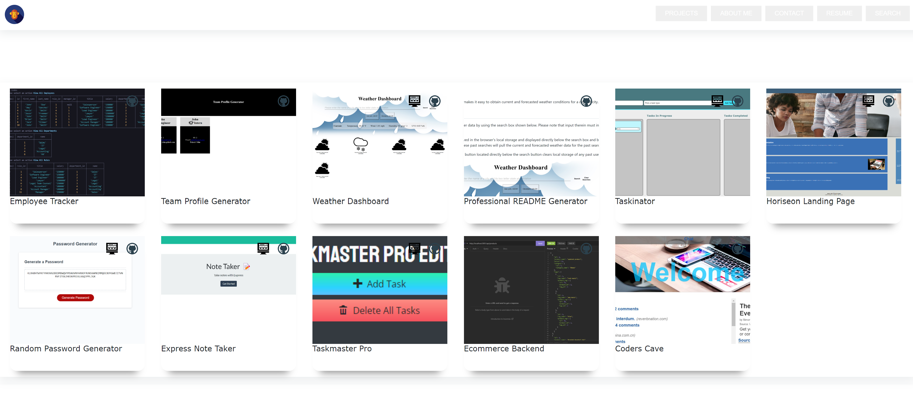
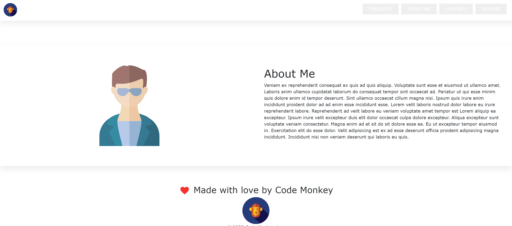
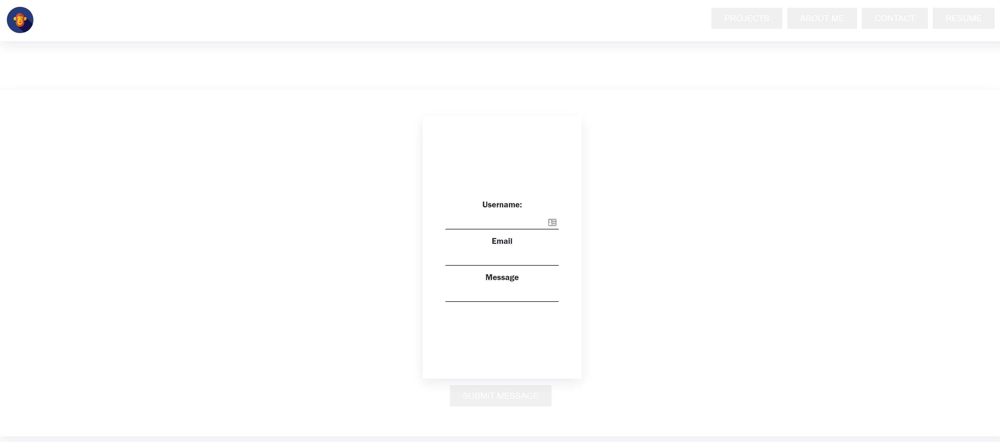
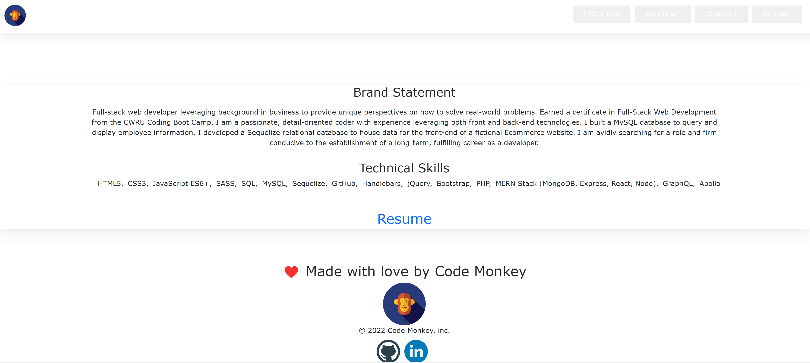

# React Portfolio

This repository contains the source code for my React Portfolio.

## Table of Contents

[Description](#Description)  
[Features](#How-It-Works)  
[Installation](#Installation)  
[Usage](#Usage)  
[Credits](#Credits)  
[Contributing](#Contributing)
[Contact](#Contact)  
[License](#License)

## Description

This project is a react-only version of my portfolio. My non-React portfolio (built using only HTML, CSS and JavaScript) can be found here:

https://rrich-kray.github.io/project-portfolio/

I consider this an MVP build, and plan to add several new features in the near future, including modals that appear when a project is selected. These will provide additional project information, including a description and screenshots. I also intend to add project search functionality.

## Features

In its current build, this project allows users to view:

- A protfolio of my projects
- An about me component containing a bio and profile picture
- A component which allows the user to send me a message using a React form
- A resume component, which contains a brand statement, a list of technical competencies, and a link to my resume

## How it Works

The application was built using React, and consists of the following:

- An About component
- A Contact component
- A Footer component
- A Hero Component
- A Projects Component
- A Resume Component

The Footer and Hero sections are displayed on all pages. The header contains links that, when selected, call function closers that change a state within its parent component, which in turn renders the selected component of the website.

For example, selecting the "ABOUT ME" link within the navigation bar will render the following page:

Selecting "CONTACT" renders a component that allows the user to submit a message using the form shown below:

Lastly, selecting "RESUME" renders a component that displays my aptitudes as well as a link to my resume:

## Installation

No installation is required to access the website. Simply follow the link below to access and use the application:

https://rrich-kray.github.io/react-portfolio/

## Contributing

Please follow the guidelines below if you wish to contribute to this project.

-Fork the repo on GitHub
-Clone the project to your own machine
-Commit changes to your own branch
-Push your work back up to your fork
-Submit a Pull request so that I can review your changes

## Credits

The design of my portfolio page was based on the following website:

https://www.uidesigndaily.com/

## Contact

GitHub profile:

https://github.com/rrich-kray/

Email inquiries:

rrich.kray.93@gmail.com

## License

Copyright (c) 2022, Ryan Kray
All rights reserved.

This source code is licensed under the BSD-style license found in the LICENSE file in the root directory of this source tree and reproduced below.

Redistribution and use in source and binary forms, with or without modification, are permitted provided that the following conditions are met:

1. Redistributions of source code must retain the above copyright notice, this list of conditions and the following disclaimer.
2. Redistributions in binary form must reproduce the above copyright notice, this list of conditions and the following disclaimer in the documentation and/or other materials provided with the distribution.
3. All advertising materials mentioning features or use of this software must display the following acknowledgement: This product includes software developed by Ryan Kray.
4. Neither the name of this application's developer nor the names of its contributors may be used to endorse or promote products derived from this software without specific prior written permission.

THIS SOFTWARE IS PROVIDED BY THE COPYRIGHT HOLDER ''AS IS'' AND ANY EXPRESS OR IMPLIED WARRANTIES, INCLUDING, BUT NOT LIMITED TO, THE IMPLIED WARRANTIES OF MERCHANTABILITY AND FITNESS FOR A PARTICULAR PURPOSE ARE DISCLAIMED. IN NO EVENT SHALL THE COPYRIGHT HOLDER OR CONTRIBUTORS BE LIABLE FOR ANY DIRECT, INDIRECT, INCIDENTAL, SPECIAL, EXEMPLARY, OR CONSEQUENTIAL DAMAGES (INCLUDING, BUT NOT LIMITED TO, PROCUREMENT OF SUBSTITUTE GOODS OR SERVICES; LOSS OF USE, DATA, OR PROFITS; OR BUSINESS INTERRUPTION) HOWEVER CAUSED AND ON ANY THEORY OF LIABILITY, WHETHER IN CONTRACT, STRICT LIABILITY, OR TORT (INCLUDING NEGLIGENCE OR OTHERWISE) ARISING IN ANY WAY OUT OF THE USE OF THIS SOFTWARE, EVEN IF ADVISED OF THE POSSIBILITY OF SUCH DAMAGE.
